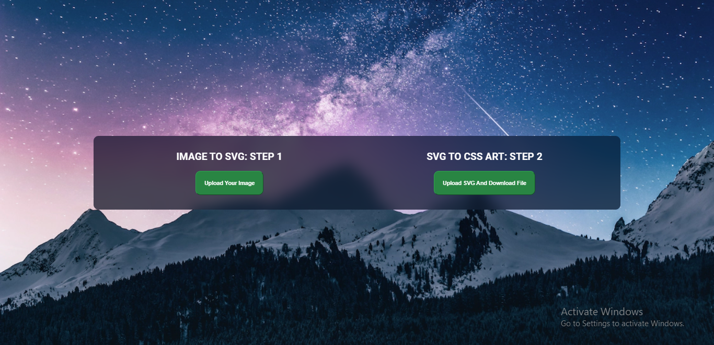

# imgToCSSart Documentation

The web application transforms images into CSS art by first converting the image to SVG and then converting the SVG path into the "css clip-path: Polygon()" format.

## Installation

To install all the dependencies, run:

npm install

## Testing

To run the tests, use:

npm test

## Starting the Application

To start the application, use:

npm start

This will lead you to the server page at [http://localhost:3000](http://localhost:3000), where 3000 is the port set for development.

## Preview

## Image to CSS Art Conversion

After running the application, you can convert images into CSS art. Upload an image through the web app, and it will process it, generating CSS code in the "css clip-path: Polygon()" format.

Happy converting!
